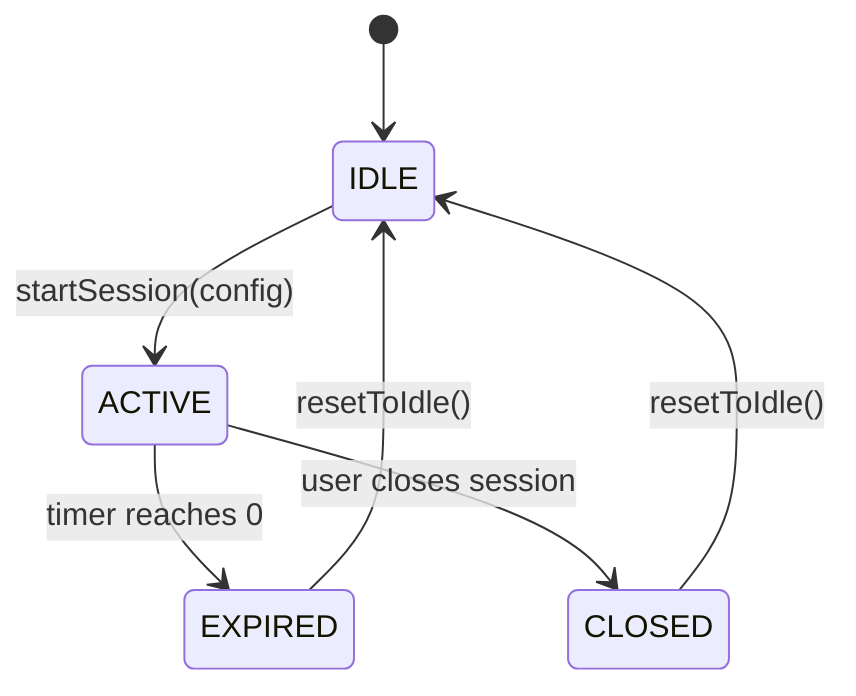
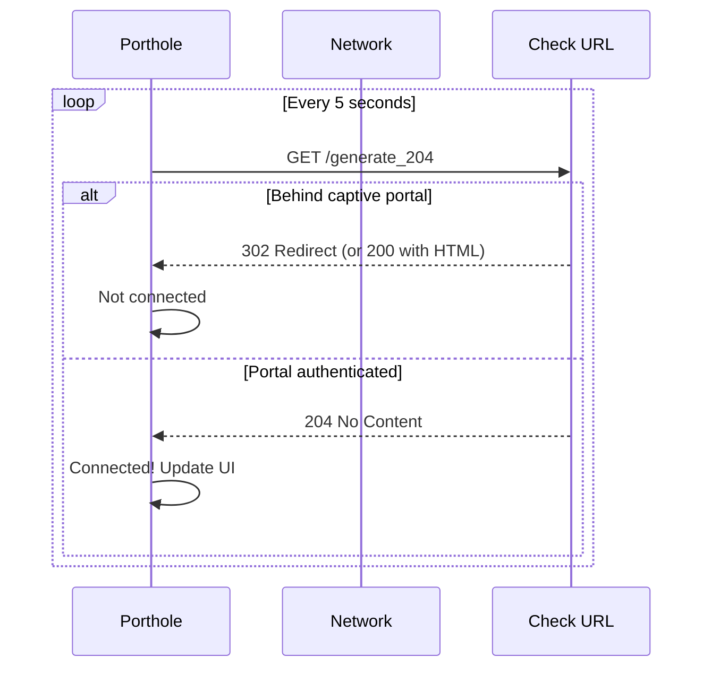
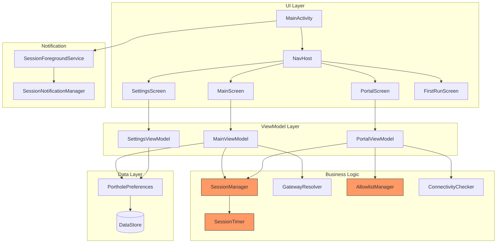

# Porthole Architecture

## Overview

Porthole is a single-activity Android application built with Jetpack Compose, Hilt dependency injection, and Kotlin Coroutines. It follows a unidirectional data flow pattern with ViewModels mediating between the business logic layer and the Compose UI.

## Package Structure

```
com.stevenfoerster.porthole/
├── PortholeApplication.kt          # Hilt application entry point
├── di/
│   └── AppModule.kt                # Hilt dependency providers
├── session/
│   ├── SessionConfig.kt            # Session configuration data class
│   ├── SessionState.kt             # Session state enum
│   ├── SessionManager.kt           # Session lifecycle singleton
│   └── SessionTimer.kt             # Coroutine-based countdown
├── network/
│   ├── GatewayResolver.kt          # WiFi gateway IP resolution
│   ├── AllowlistManager.kt         # Navigation URL allowlist
│   └── ConnectivityChecker.kt      # Portal auth success detection
├── webview/
│   ├── PortholeWebViewClient.kt    # Allowlist-enforcing WebViewClient
│   └── WebViewSettings.kt          # WebView security hardening
├── notification/
│   ├── SessionNotificationManager.kt  # Notification building/updating
│   └── SessionForegroundService.kt    # Foreground service for persistence
├── settings/
│   └── PortholePreferences.kt      # DataStore preferences wrapper
└── ui/
    ├── MainActivity.kt             # Single activity, navigation host
    ├── FirstRunScreen.kt           # Onboarding/setup screen
    ├── MainScreen.kt               # Home screen with launch button
    ├── PortalScreen.kt             # WebView portal screen
    ├── SettingsScreen.kt           # Configuration screen
    ├── navigation/
    │   └── PortholeNavigation.kt   # Route constants
    ├── viewmodel/
    │   ├── MainViewModel.kt        # Main screen business logic
    │   ├── PortalViewModel.kt      # Portal screen business logic
    │   └── SettingsViewModel.kt    # Settings screen business logic
    ├── theme/
    │   └── Theme.kt                # Material 3 theme
    └── components/
        └── SessionStatusBar.kt     # Active session status composable
```

## Session State Machine



### State Descriptions

| State | Description | Valid Transitions |
|---|---|---|
| `IDLE` | No session active. App is in resting state. | → `ACTIVE` |
| `ACTIVE` | Session in progress. WebView is live, timer counting down. | → `EXPIRED`, → `CLOSED` |
| `EXPIRED` | Timer reached zero. Cleanup in progress. | → `IDLE` |
| `CLOSED` | User manually closed session. Cleanup in progress. | → `IDLE` |

### ASCII State Diagram

```
    ┌──────┐  startSession()  ┌────────┐
    │ IDLE │ ───────────────→ │ ACTIVE │
    └──────┘                  └────────┘
       ↑                      │      │
       │            timer=0   │      │  user close
       │                      ↓      ↓
       │  resetToIdle()  ┌─────────┐ ┌────────┐
       ├─────────────────│ EXPIRED │ │ CLOSED │
       │                 └─────────┘ └────────┘
       └──────────────────────────────────┘
                       resetToIdle()
```

## VPN Exclusion Mechanism

Porthole relies on Android's per-app VPN exclusion (split tunneling) feature, which is built into the Android VPN framework and exposed by VPN apps like WireGuard.

When Porthole is added to the VPN's excluded apps list:
1. The Android kernel routes Porthole's traffic outside the VPN tunnel
2. All other apps continue through the tunnel
3. Porthole can reach the captive portal's local gateway directly
4. The rest of the device remains protected

This is an OS-level mechanism — Porthole does not implement or interact with the VPN directly. It simply needs to be in the exclusion list.

## WebView Sandboxing

The WebView is the security-critical component. Every setting is a deliberate decision:

| Setting | Value | Rationale |
|---|---|---|
| `javaScriptEnabled` | `false` (default) | Largest attack surface reduction. Most portals work without JS. |
| `allowFileAccess` | `false` | Prevents `file://` URI access to local filesystem. |
| `allowContentAccess` | `false` | Prevents access to content providers via `content://` URIs. |
| `geolocationEnabled` | `false` | No portal needs location. Prevents tracking. |
| `savePassword` | `false` | Never persist credentials to disk. |
| `saveFormData` | `false` | Never persist form data to disk. |
| `databaseEnabled` | `false` | Prevents WebSQL database creation. |
| `domStorageEnabled` | `false` (unless JS on) | Prevents localStorage/sessionStorage when JS is off. |
| `cacheMode` | `LOAD_NO_CACHE` | Always fetch from network, never serve from cache. |
| `mixedContentMode` | `NEVER_ALLOW` | Block mixed HTTP/HTTPS content to prevent downgrade. |
| `mediaPlaybackRequiresUserGesture` | `true` | Prevent auto-playing media from hostile portals. |

### Lifecycle

1. **Creation**: A new `WebView` instance is created at the start of each session via `AndroidView` factory
2. **Configuration**: `WebViewSettings.apply()` applies all hardening settings
3. **Navigation**: `PortholeWebViewClient` intercepts every URL against the allowlist
4. **Destruction**: On session end, `performSessionCleanup()` clears cookies, storage, cache, then calls `destroy()`

The WebView is **never reused** across sessions.

## AllowlistManager Logic

### Strict Mode (default)

```
URL requested
  → Extract host
    → Is host in allowedHosts set? → ALLOW
    → Does host resolve to RFC 1918 address? → ADD to set, ALLOW
    → Otherwise → BLOCK (show warning page)
```

RFC 1918 ranges (detected via `InetAddress.isSiteLocalAddress()`):
- `10.0.0.0/8`
- `172.16.0.0/12`
- `192.168.0.0/16`

Plus loopback (`127.0.0.0/8`).

### Permissive Mode

```
URL requested
  → Extract host
    → Is host in allowedHosts set? → ALLOW
    → Does host resolve to RFC 1918 address? → ADD to set, ALLOW
    → Otherwise → BLOCK, but show dialog offering to add host
      → User confirms → ADD to set (subsequent requests ALLOW)
      → User denies → remain BLOCKED
```

## Connectivity Check Mechanism

Porthole polls a connectivity check URL to detect when captive portal authentication has succeeded:



The default check URL is `https://connectivitycheck.stevenfoerster.com/generate_204`, falling back to Google's `http://connectivitycheck.gstatic.com/generate_204`.

## Data Flow



## Dependency Injection

Hilt provides:
- `CoroutineScope` — Application-scoped, `SupervisorJob + Dispatchers.Main`
- `WifiManager` — System service for gateway resolution
- All `@Singleton` classes — `SessionManager`, `SessionTimer`, `GatewayResolver`, `AllowlistManager`, `ConnectivityChecker`, `PortholePreferences`, `SessionNotificationManager`
- ViewModels — `@HiltViewModel` with constructor injection

## Threading Model

- **Main thread**: All WebView interactions, UI composition, state updates
- **IO dispatcher**: Connectivity check HTTP calls (`ConnectivityChecker.performCheck`)
- **Coroutine scope**: Session timer runs in the application-scoped coroutine scope, ensuring it continues even if the ViewModel is cleared
